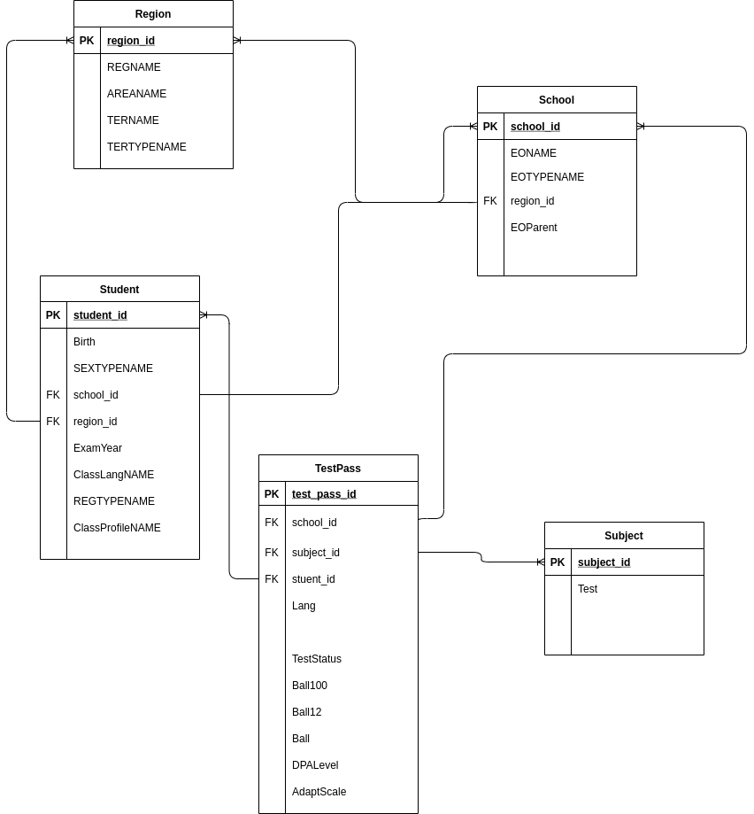
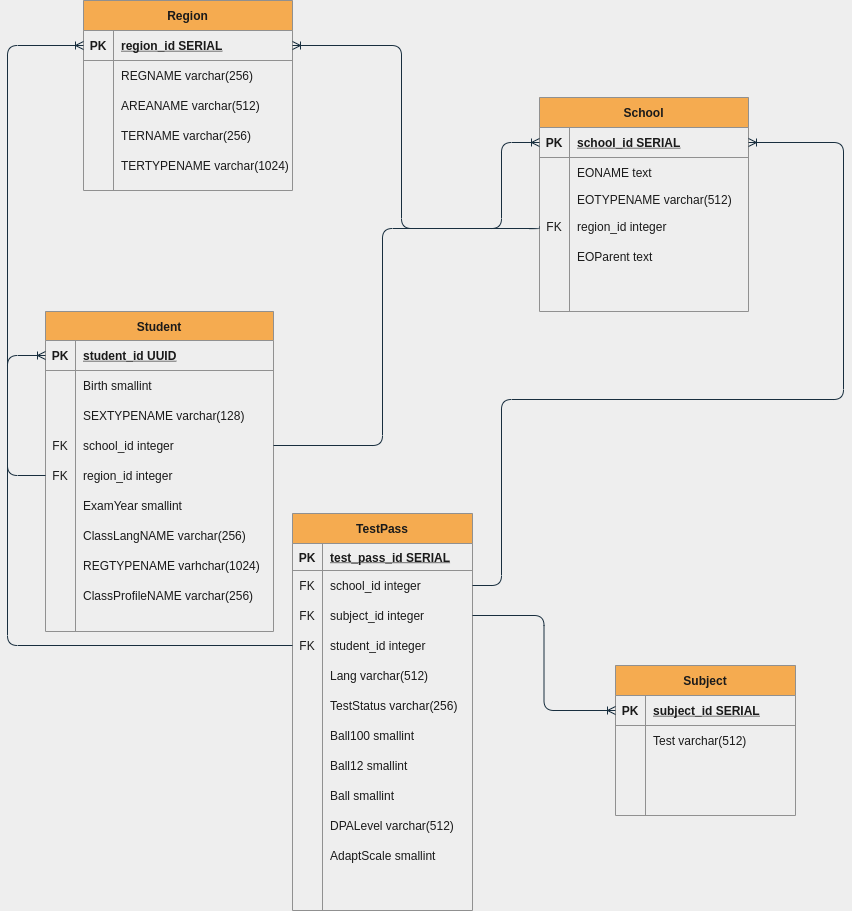

# Лабораторна робота №2 студента групи КМ-81 Піткевича Іллі

## Запуск програми
Спочатку запустіть сервер з бд та pgadmin ```docker-compose up```
Потім можливо два сценарії:
1. Спочатку імпортувати дані за допомогою скрипта з 1 лаби (тобто створиться таблиця с даними), а потім за допомогою flyway та інструкції ```baseline``` будуть створюватися міграціїї з цієї точки. Для виконання наступні інструкції: 
```
. .env
source env/bin/activate
python main.py #Чекаємо поки всі дані імпортуються
docker-compose -f docker-compose.migrate_via_flyway.yaml up #Чекаємо поки відбудуться всі міграції
```
2. Зразу запустити міграції за допомогою flyway. Для виконання наступні інструкції:
```
docker-compose -f docker-compose.migrate_via_flyway.yaml up #Чекаємо поки відбудуться всі міграції
```
Після виконання одного зі сценаріїв можна зайти в PGAdmin та перевірити, що стоврились таблиці.
*В першому сценарії з даними, в другому з нуля будуть створені таблиці.*

## Логічна та фізична діаграми



## Опис дії програми
В міграціях створюються 5 таблиць(їх поля та формати можливо побачити на діаграмах вище), потоім послідовно вставляються дані в кожну с 5-и таблиць.

## Logs міграцій
1. На чисту бд
```
flyway_1  | Flyway Community Edition 7.7.2 by Redgate
flyway_1  | Database: jdbc:postgresql://db:5432/postgres (PostgreSQL 13.2)
flyway_1  | Successfully validated 10 migrations (execution time 00:00.012s)
flyway_1  | Creating Schema History table "public"."flyway_schema_history" ...
flyway_1  | 0 rows affected
flyway_1  | 0 rows affected
flyway_1  | 0 rows affected
flyway_1  | Current version of schema "public": << Empty Schema >>
flyway_1  | Migrating schema "public" to version "1 - Create zno table"
flyway_1  | 0 rows affected
flyway_1  | 0 rows affected
flyway_1  | Migrating schema "public" to version "2 - Create tables"
flyway_1  | 0 rows affected
flyway_1  | 0 rows affected
flyway_1  | 0 rows affected
flyway_1  | 0 rows affected
flyway_1  | 0 rows affected
flyway_1  | Migrating schema "public" to version "3 - Insert subject data"
flyway_1  | 0 rows affected
flyway_1  | 0 rows affected
flyway_1  | 0 rows affected
flyway_1  | 0 rows affected
flyway_1  | 0 rows affected
flyway_1  | 0 rows affected
flyway_1  | 0 rows affected
flyway_1  | 0 rows affected
flyway_1  | 0 rows affected
flyway_1  | 0 rows affected
flyway_1  | 0 rows affected
flyway_1  | Migrating schema "public" to version "4 - Insert area data"
flyway_1  | 0 rows affected
flyway_1  | 0 rows affected
flyway_1  | Migrating schema "public" to version "5 - Inserting school date"
flyway_1  | 0 rows affected
flyway_1  | Migrating schema "public" to version "6 - Inserting student data"
flyway_1  | 0 rows affected
flyway_1  | Migrating schema "public" to version "7 - Inserting test pass data"
flyway_1  | 0 rows affected
flyway_1  | 0 rows affected
flyway_1  | 0 rows affected
flyway_1  | 0 rows affected
flyway_1  | 0 rows affected
flyway_1  | 0 rows affected
flyway_1  | 0 rows affected
flyway_1  | 0 rows affected
flyway_1  | 0 rows affected
flyway_1  | 0 rows affected
flyway_1  | 0 rows affected
flyway_1  | Migrating schema "public" to version "8 - Deleting null from tables"
flyway_1  | 0 rows affected
flyway_1  | Migrating schema "public" to version "9 - Delete null from subject"
flyway_1  | 0 rows affected
flyway_1  | Migrating schema "public" to version "10 - Deleting old tables"
flyway_1  | 0 rows affected
flyway_1  | 0 rows affected
flyway_1  | Successfully applied 10 migrations to schema "public", now at version v10 (execution time 00:00.151s)
second_lab_flyway_1 exited with code 0
```
2. З даними в бд
```
flyway_1  | Flyway Community Edition 7.7.2 by Redgate
flyway_1  | Database: jdbc:postgresql://db:5432/postgres (PostgreSQL 13.2)
flyway_1  | Successfully validated 10 migrations (execution time 00:00.018s)
flyway_1  | Creating Schema History table "public"."flyway_schema_history" with baseline ...
flyway_1  | 0 rows affected
flyway_1  | 1 rows affected
flyway_1  | 0 rows affected
flyway_1  | 0 rows affected
flyway_1  | Successfully baselined schema with version: 1
flyway_1  | Current version of schema "public": 1
flyway_1  | Migrating schema "public" to version "2 - Create tables"
flyway_1  | 0 rows affected
flyway_1  | 0 rows affected
flyway_1  | 0 rows affected
flyway_1  | 0 rows affected
flyway_1  | 0 rows affected
flyway_1  | Migrating schema "public" to version "3 - Insert subject data"
flyway_1  | 2 rows affected
flyway_1  | 2 rows affected
flyway_1  | 2 rows affected
flyway_1  | 2 rows affected
flyway_1  | 2 rows affected
flyway_1  | 2 rows affected
flyway_1  | 2 rows affected
flyway_1  | 2 rows affected
flyway_1  | 2 rows affected
flyway_1  | 2 rows affected
flyway_1  | 2 rows affected
flyway_1  | Migrating schema "public" to version "4 - Insert area data"
flyway_1  | 10220 rows affected
flyway_1  | 221 rows affected
flyway_1  | Migrating schema "public" to version "5 - Inserting school date"
flyway_1  | 89658 rows affected
flyway_1  | Migrating schema "public" to version "6 - Inserting student data"
flyway_1  | 733112 rows affected
flyway_1  | Migrating schema "public" to version "7 - Inserting test pass data"
flyway_1  | 733112 rows affected
flyway_1  | 733112 rows affected
flyway_1  | 733112 rows affected
flyway_1  | 733112 rows affected
flyway_1  | 733112 rows affected
flyway_1  | 733112 rows affected
flyway_1  | 733112 rows affected
flyway_1  | 733112 rows affected
flyway_1  | 733112 rows affected
flyway_1  | 733112 rows affected
flyway_1  | 733112 rows affected
flyway_1  | Migrating schema "public" to version "8 - Deleting null from tables"
flyway_1  | 5795382 rows affected
flyway_1  | Migrating schema "public" to version "9 - Delete null from subject"
flyway_1  | 11 rows affected
flyway_1  | Migrating schema "public" to version "10 - Deleting old tables"
flyway_1  | 0 rows affected
flyway_1  | 0 rows affected
flyway_1  | Successfully applied 9 migrations to schema "public", now at version v10 (execution time 03:06.969s)
second_lab_flyway_1 exited with code 0

```